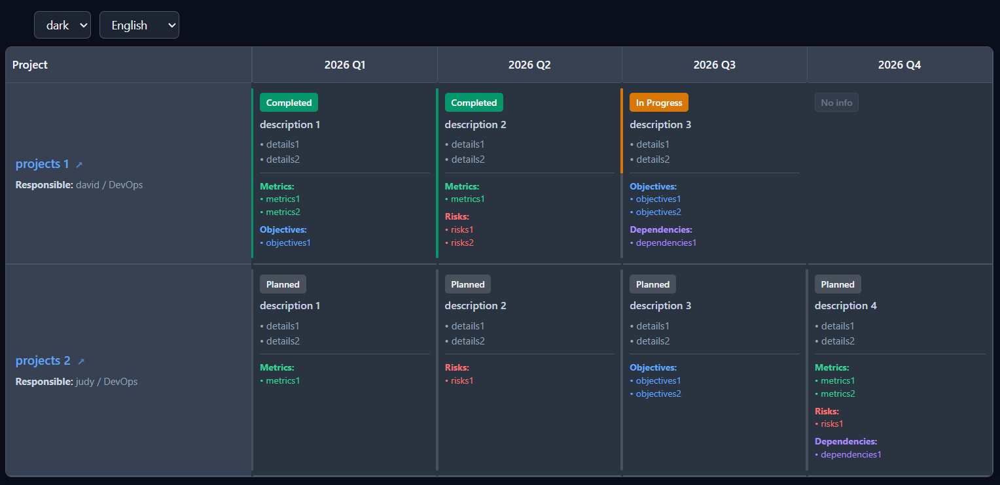

# json-roadmap

A zero-dependency component that renders a roadmap table from JSON data.

- **Zero dependencies, zero build** — just open the HTML file. No Node, no bundler.
- **Plain JSON data** — the data is standard JSON inside the HTML, so **someone who knows no JavaScript at all can edit it**
- **Tiny** — about 18 KB, a single file.
- **5 languages** — English / 简体中文 / 繁體中文 / 日本語 / 한국어
- **2 themes** — dark / light, with **zero layout shift** when switching. Only colors change.
- CSS + rendering + theming + i18n all live in `roadmap.js`.

---

## Preview



---

## Usage

```html
<!-- (1) Data: plain JSON — this is the only block you edit -->
<script type="application/json" id="roadmap-data">
  {
    "theme": "dark",
    "language": "en",
    "columns": ["Q1", "Q2", "Q3"],
    "projects": [
      { "name": "Project A", "cells": { "Q1": { "description": "Kickoff", "progress": "100%" } } },
      { "name": "Project B", "cells": { "Q2": { "description": "In design" } } }
    ]
  }
</script>

<!-- (2) Rendering: fixed code, never touched -->
<div id="roadmap"></div>

<script src="./roadmap.js"></script>

<script>
  Roadmap.mount('#roadmap', '#roadmap-data');
</script>
```

That is a complete, working page. **Neither `roadmap.js` nor the last script block ever needs to change** —
swapping the roadmap means editing the JSON in (1). The JSON above is a minimal skeleton; [Data format](#data-format)
below prints in full the data that `example.html` ships, which is what the screenshot shows.

### API

| Method | Description |
| --- | --- |
| `Roadmap.mount(target, data, options?)` | Injects styles, applies theme and language, renders the table; returns the container element |
| `Roadmap.render(data, options?)` | Returns the table HTML string only. It never changes the DOM, and on bad data it **throws** with the reason instead of showing the red box |
| `Roadmap.readJSON(source)` | Reads a CSS selector / DOM element / JSON text into an object; throws with the reason if parsing fails |
| `Roadmap.setTheme('dark' \| 'light')` | Switch theme separately |
| `Roadmap.getTheme()` | Returns the current theme name |
| `Roadmap.version` | The component version string |
| `Roadmap.css` | The component's CSS string |
| `Roadmap.langs` | The five string tables — edit or extend them directly |

The `data` argument of `mount` / `render` accepts any of: a selector (`'#roadmap-data'`), a DOM element,
JSON text, or an already-parsed object.

`options`:

| Option | Default | Description |
| --- | --- | --- |
| `theme` | `data.theme` → `'dark'` | `'dark'` \| `'light'`, overrides the root config |
| `language` | `data.language` → `'en'` | `'en'` \| `'chs'` \| `'cht'` \| `'ja'` \| `'ko'`, overrides the root config |
| `showInternal` | `false` | When `true`, renders content marked `internal` |

`target` accepts either a CSS selector or a DOM element; `mount` adds a `.container` class to it.

**Broken data never leaves you with a blank page**: `mount` renders a red box inside the container and logs
the original error to the console (`console.error`). It covers three kinds of trouble: JSON syntax errors
(with the line and column), structural errors (a missing `columns` or `projects`, a `projects[i]` that is not
an object, a `projects[i]` that nests another `projects` — each naming the exact index), and "nothing to
render" for data that is valid but produces an empty table. It only throws when the container itself cannot
be found.

---

## Data format

This is the data `example.html` ships — the very data the screenshot above renders.

```json
{
  "theme": "dark",
  "language": "en",

  "columns": [
    "2026 Q1",
    "2026 Q2",
    "2026 Q3",
    "2026 Q4"
  ],

  "projects": [
    {
      "name": "projects 1",
      "responsible": "david / DevOps",
      "issue": "https://github.com/your-org/infra/issues/101",
      "cells": {
        "2026 Q1": {
          "description": "description 1",
          "details": ["details1", "details2"],
          "progress": "100%",
          "metrics": ["metrics1", "metrics2"],
          "objectives": ["objectives1"]
        },
        "2026 Q2": {
          "description": "description 2",
          "details": ["details1", "details2"],
          "progress": "100%",
          "risks": ["risks1", "risks2"],
          "metrics": ["metrics1"]
        },
        "2026 Q3": {
          "description": "description 3",
          "details": ["details1", "details2"],
          "progress": "50%",
          "objectives": ["objectives1", "objectives2"],
          "dependencies": ["dependencies1"]
        }
      }
    },
    {
      "name": "projects 2",
      "responsible": "judy / DevOps",
      "issue": "https://github.com/your-org/infra/issues/102",
      "cells": {
        "2026 Q1": {
          "description": "description 1",
          "details": ["details1", "details2"],
          "metrics": ["metrics1"]
        },
        "2026 Q2": {
          "description": "description 2",
          "details": ["details1", "details2"],
          "risks": ["risks1"]
        },
        "2026 Q3": {
          "description": "description 3",
          "details": ["details1", "details2"],
          "objectives": ["objectives1", "objectives2"]
        },
        "2026 Q4": {
          "description": "description 4",
          "details": ["details1", "details2"],
          "risks": ["risks1"],
          "metrics": ["metrics1", "metrics2"],
          "dependencies": ["dependencies1"]
        }
      }
    }
  ]
}
```

> The block above is verbatim the JSON inside `example.html`, so it can be copied as is.
> Remember that **JSON allows no comments**, every key and string must be double-quoted,
> and no trailing comma is allowed.

---

## Fields

`✅` marks what the schema needs; only `columns` and `projects` are actually checked at runtime (everything
else fails soft — a missing `name` renders an empty cell rather than an error).

### Root

| Field | Required | Actual behavior in code |
| --- | :---: | --- |
| `theme` | | Any value other than `'light'` is treated as `'dark'` |
| `language` | | `en` / `chs` / `cht` / `ja` / `ko`; **unknown values fall back to `en`** |
| `columns` | ✅ | Array of column names, rendered left to right. **Any format, any count** (`Q1-2025` or `processor` both work); overflows into horizontal scrolling |
| `projects` | ✅ | Array of projects, each rendered as one table row |
| `title` | | When present, a title bar (the title plus an "N projects" count) is rendered above the table; omit it for no title bar |

### projects[]

| Field | Required | Actual behavior in code |
| --- | :---: | --- |
| `name` | ✅ | Project name |
| `responsible` | | Shown under the project name, prefixed with a localized "Responsible:" label |
| `issue` | | When present, the project name becomes a link opening in a new tab, with a ↗ |
| `internal` | | `true` = the project is filtered out of the public view (`showInternal: false`) |
| `cells` | | Per-column data. Keys must match the top-level `columns` names **exactly**, or that cell shows `No info` |

### projects[].cells.<column>

| Field | Actual behavior in code |
| --- | --- |
| `description` | Main cell text (bold) |
| `details` | Bullet list, each entry prefixed with `• ` |
| `progress` | **Drives the fill height and color of the left vertical line.** Omitted = `0`. Accepts `'70%'`, `'3/4'`; percentages are clamped to 0–100, unparseable text is treated as `0` |
| `metrics` / `risks` / `objectives` / `dependencies` | Four lists with colored headings; heading text is localized |
| `internal` | ⚠️ **Not implemented yet** — the code does not filter at the cell level, so it has no effect |
| `internal_notes` | ⚠️ The code **never reads** this field; it is not shown in any view |

### Two forms for list items

Every entry in `details` / `metrics` / `risks` / `objectives` / `dependencies` can be plain text, or an object with a `text` property:

```json
"details": [
  "Visible to everyone",
  { "text": "Confidential, hidden from the public view", "internal": true }
]
```

---

## Status is derived from progress — there is no status field

The data has **no** `status` field. The state is computed entirely from `progress`:

| `progress` | State | Badge | Left vertical line |
| --- | --- | --- | --- |
| omitted / `0%` | planned | Grey background (same as the track) | All grey |
| `0%` < progress < `100%` | in-progress | Orange background, white text | Orange filling **top-down** |
| `100%` | completed | Green background, white text | All green |

The line itself is a **grey track** (representing the full 0–100%), and the colored part fills from the top down — its length is the progress.

---

## Languages

| Key | Language | Status labels | Project column header | Responsible | Count |
| --- | --- | --- | --- | --- | --- |
| `en` | English (default) | Completed / In Progress / Planned | Project | Responsible: | 2 projects |
| `chs` | 简体中文 | 已完成 / 进行中 / 计划中 | 项目 | 负责人: | 2 个项目 |
| `cht` | 繁體中文 | 已完成 / 進行中 / 計劃中 | 項目 | 負責人: | 2 個項目 |
| `ja` | 日本語 | 完了 / 進行中 / 計画中 | プロジェクト | 担当者: | 2 件のプロジェクト |
| `ko` | 한국어 | 완료 / 진행 중 / 계획 중 | 프로젝트 | 담당자: | 2 개의 프로젝트 |

`cht` uses wording common to Hong Kong and Taiwan: `進行中`, `計劃中`, `項目`, `負責人`, `暫無資訊`, `指標` / `風險` / `目標` / `依賴`.

Beyond the status labels, these are localized too: the empty-cell `No info`, the `Project` column header, the responsible label, the four `Metrics:` / `Risks:` / `Objectives:` / `Dependencies:` headings, and the project count.

**Adding a sixth language**: copy a block in `roadmap.js`'s `LANGS` table — **the keys must match exactly**:

```js
LANGS.fr = {
  completed: 'Terminé',
  'in-progress': 'En cours',
  planned: 'Prévu',
  noInfo: 'Aucune info',
  project: 'Projet',
  responsible: 'Responsable:',
  metrics: 'Indicateurs:',
  risks: 'Risques:',
  objectives: 'Objectifs:',
  dependencies: 'Dépendances:',
  unit: 'projets',
  unitOne: 'projet',
};
```

---

## Themes

Both themes share **one set of geometry** (sizes, spacing, positions, fonts, line heights, border widths all come from dark); light only swaps the color variables. So switching themes never moves text or changes any size — **only colors differ**.

Every theme-dependent color lives in one of two blocks — 18 variables each:

```css
html[data-theme='dark']  { --rm-bg:#0a0f1c; --rm-text:#f1f5f9; ... }
html[data-theme='light'] { --rm-bg:#ffffff; --rm-text:#0f172a; ... }
```

The rules only ever use `var(--rm-*)`. To restyle, edit those two blocks — **never hardcode colors or sizes in the rules**, or you break the zero-shift guarantee.

Three more variables sit in `:root` because both themes share them: `--rm-completed`, `--rm-progress` and
`--rm-badge-text`. The per-cell progress bar uses two more — `--rm-fill` and `--rm-fill-color` — which
`roadmap.js` writes into that cell's inline `style` at render time.

---

## FAQ

**Q: Why is the data inlined in the HTML instead of a standalone `data.json`?**
A: Browsers block `fetch` of local `.json` from `file://` pages (CORS). A
`<script type="application/json">` block keeps the content as **standard JSON** (not JavaScript),
so the page still opens by double-click with no server — and no JS knowledge required.
If you only ever serve over HTTP (say GitHub Pages), `Roadmap.mount(el, await (await fetch('data.json')).json())` works fine too.

**Q: A cell shows `No info`?**
A: Either (1) the project simply has no data for that column, or (2) the key does not match the
column name exactly (case and spaces count) — in which case that block of data is silently ignored.

**Q: I edited the JSON and the page is blank / shows a red box?**
A: The red box tells you where and why the JSON failed. Nine times out of ten it is one of three things:
single quotes (or no quotes) around a key, a trailing comma after the last item, or a `//` comment.
After fixing it, just reload the page — or switch the theme/language picker, because `example.html`
re-reads the JSON on every render.

**Q: How do I export a PDF?**
A: Use your browser's `Ctrl+P`.

## Reference

- [roadmap-gen](https://github.com/davlgd/roadmap-gen) — this component's geometry and palette are derived from its built-in default theme

## License

MIT
